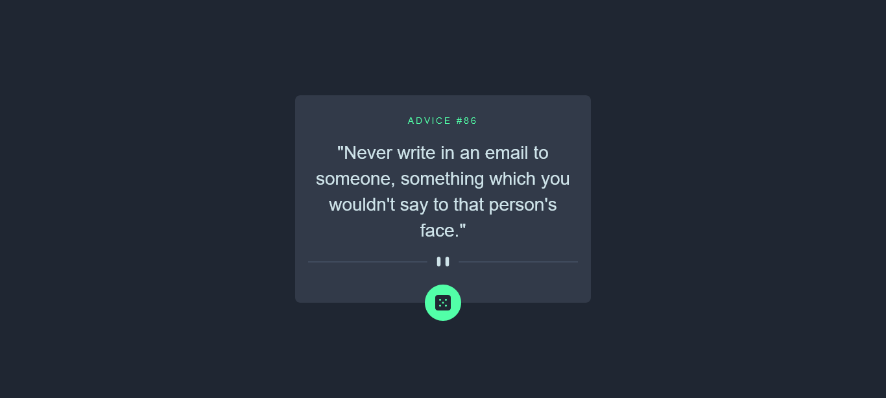
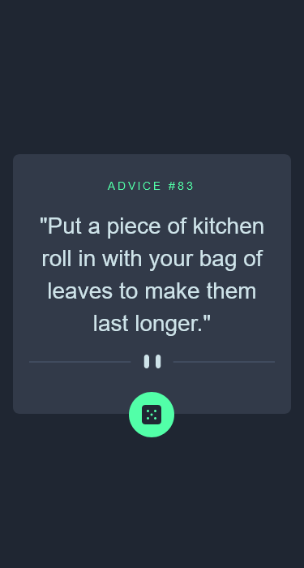

# Frontend Mentor - Advice generator app solution

This is a solution to the [Advice generator app challenge on Frontend Mentor]

## Overview

A forntend challenge advice generator app with a mobile first approach and tailwindcss styling powered by advice slip JSON API.

### The challenge

Users should be able to:

- View the optimal layout for the app depending on their device's screen size
- See hover states for all interactive elements on the page
- Generate a new piece of advice by clicking the dice icon

### Screenshot

### Links

- Solution URL: [Github Solution URL](https://github.com/olanrewajuyusuf/Advice-generator)
- Live Site URL: [Netlify Advice Generator live site](https://wallewdev-advice-generator.netlify.app/)

## My process

Mobile first approach using tailwind library.

### Built with

- Semantic HTML5 markup
- CSS custom properties
- Flexbox
- Mobile-first workflow
- [Tailwind](https://tailwindcss.com/) - For styles

### What I learned

Indepth usage of library, tailwind in particular.

### Continued development

Always learnig, thanks to this platform for this great opportunity

## Author

- Frontend Mentor - [@olanrewajuyusuf](https://www.frontendmentor.io/profile/olanrewajuyusuf)
- Twitter - [@WaliyyullahY](https://www.twitter.com/WaliyyullahY)

## Acknowledgments

To frontend mentor and her crew, Thanks so much.
